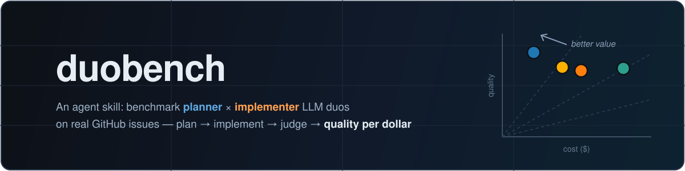
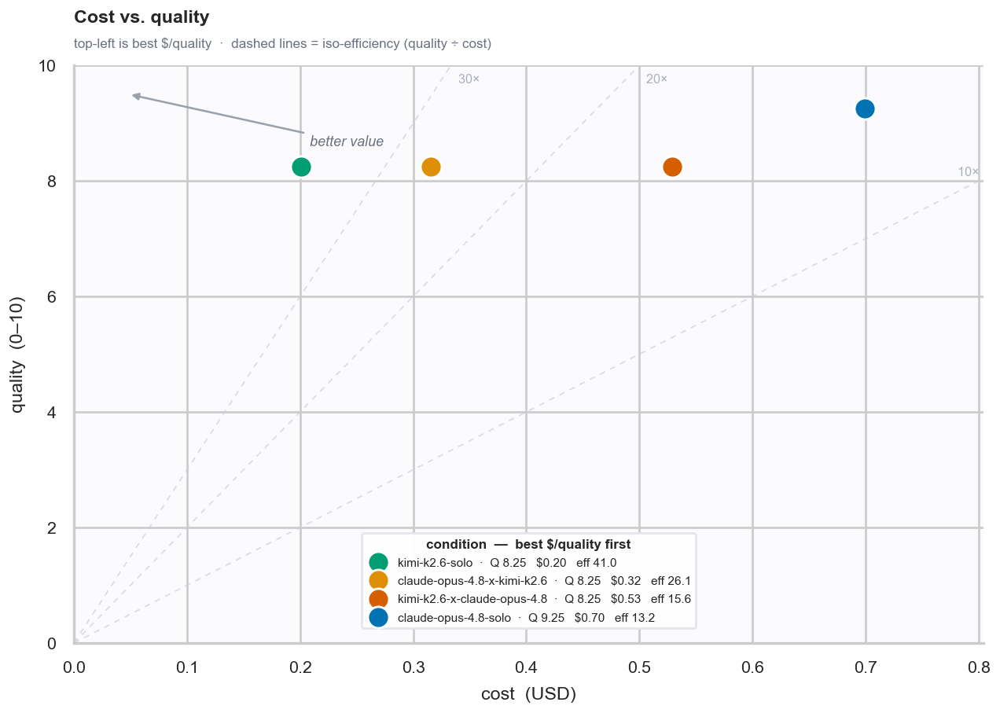
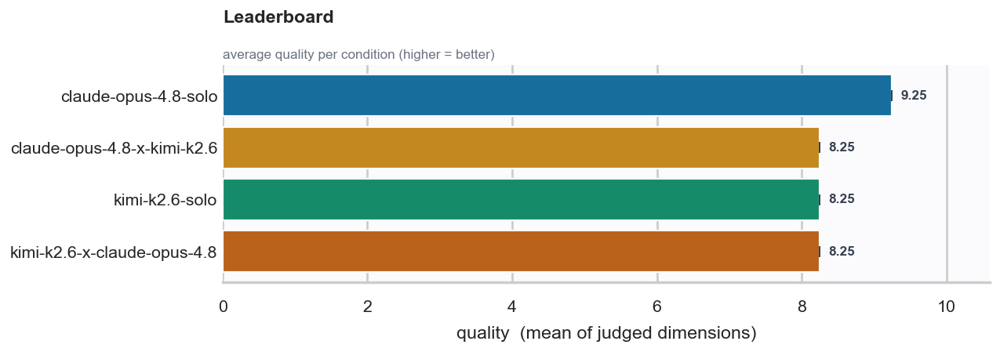
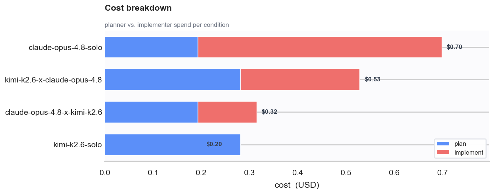
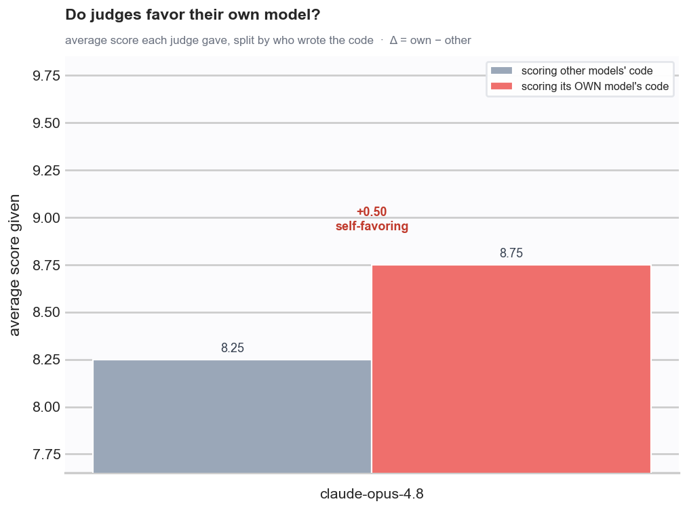

<div align="center">



<p>
  <a href="https://github.com/alejandro-ao/duobench/blob/main/LICENSE">
    
  </a>
  
  
</p>

<p>
  <a href="#quick-start">Quick Start</a> •
  <a href="#installation">Install</a> •
  <a href="#how-it-works">How It Works</a> •
  <a href="#using-the-scripts-directly">Scripts</a> •
  <a href="#output">Output</a>
</p>

</div>

---

## Overview

**duobench is not a CLI — it's a skill for coding agents** (Claude Code and
compatible harnesses). You install it once with `npx skills add`, then ask your
agent in plain language to run a benchmark; the agent does the orchestration.

It measures which **planner LLM × implementer LLM** duo produces the
best **quality-per-dollar** on a real GitHub issue, scored by a panel of judge
LLMs over [Pi](https://pi.dev) RPC.

### Prompts that trigger it

> *"Benchmark the quality:cost ratio of kimi planning + gpt-5.5 implementing,
> and vice versa, on issue #4041 of pallets/flask."*

> *"Benchmark opus and kimi on duobench and produce plots about the results."*

> *"Add a gpt planner / kimi implementer condition to the last duobench run and
> re-plot."*

> *"Re-plot the last duobench run, but correctness vs cost only, faceted by
> planner."*

### What you get

Every run ends with a `results.json`, per-condition worktrees + commits you can
inspect by hand, and a set of seaborn charts. From a real run on
[`pallets/flask#4041`](https://github.com/pallets/flask/issues/4041) with
opus-4.8 × kimi-k2.6 (4 conditions, 2 judges):

<p align="center">
  
  
</p>
<p align="center">
  
  
</p>

There is **no monolithic CLI**. An **agent orchestrates** the benchmark: it
launches thin per-phase jobs (one Pi RPC instance each) across `tmux` sessions,
gates each phase on completion, aggregates the results, and writes its own
seaborn plots. You drive it conversationally through the **`duobench` skill** in
Claude Code, or call the scripts yourself.

```
┌─────────────┐     ┌──────────────────┐     ┌──────────────┐
│   GitHub    │────▶│     Planner      │────▶│ Implementer  │────▶ local commit
│    Issue    │     │ (plan + handoff) │     │ (code only)  │        │
└─────────────┘     └──────────────────┘     └──────────────┘        │
                              ┌──────────────────────────────────────┘
                              ▼
                       ┌─────────────┐
                       │    Judges   │  ◄── score on 4 dimensions; cost from tokens
                       └─────────────┘
```

### What it does

duobench is **safe to run against public upstream issues by default** — the
implementer only ever makes a local commit:

1. **Planner** inspects the issue + repo and writes a handoff plan (read-only).
2. **Implementer** works in an isolated git worktree and creates exactly **one
   local commit**. The harness installs PATH-prepended `git`/`gh` safety wrappers
   and removes the `upstream` remote, so it cannot push branches or open PRs.
3. **Judges** inspect the commit, diff, and worktree (read-only) and score
   `task_completion`, `correctness`, `code_quality`, `verification` (1–10).
4. **You aggregate + plot**: `results.json` plus seaborn charts of
   quality-per-dollar.

> ℹ️ **No external side effects by default.** Every artifact stays in your local
> worktree under your chosen output dir (default `./duobench-runs/<timestamp>/`).
> The legacy PR-creating flow is opt-in via
> `--submission-mode pr` and is unsafe against public upstream issues.

---

## Requirements

- Python 3.11+ and [`uv`](https://docs.astral.sh/uv/)
- `git`, and the authenticated GitHub CLI [`gh`](https://cli.github.com/)
- `pi` on PATH, with configured model providers
- `tmux` (for running long phase jobs in parallel)

```bash
gh auth status && pi --version && git status && tmux -V
```

---

## Installation

Install the skill into any project (it is fully self-contained — engine,
scripts, prompts, and configs all live inside the skill directory):

```bash
npx skills add alejandro-ao/duobench
```

Then ask your agent to run a benchmark (see Quick Start). Working on duobench
itself? Clone this repo and `uv sync` — the skill is at `skills/duobench/` and
`.claude/skills` symlinks to it.

---

## Quick Start

The intended way to run duobench is to **ask the agent**. With the skill
installed, the `duobench` skill triggers on phrases like:

- *"benchmark the quality:cost ratio of kimi planning and gpt 5.5 implementing
  (and vice versa) on issue #123 of this repo"*

- *"benchmark opus and kimi on duobench and produce plots about the results"*
- *"add gpt planner and kimi implementer to the eval and produce the plots too"*

The agent will: confirm the GitHub issue + the model matrix + the estimated job
count, announce the output dir (default `./duobench-runs/<timestamp>/`), launch
the plan → implement → judge
phase jobs in `tmux` (gating each phase on completion), aggregate, and write +
run a seaborn plotting script, then show you the charts.

You can watch any job live:

```bash
tmux ls                                  # list duobench jobs
tmux attach -t <job>                     # watch one (detach with Ctrl-b then d)
tail -f <run-dir>/conditions/<cond>/trial-0/job.log
```

---

## How It Works

A **condition** is one planner×implementer pairing, identified by
`<planner>-x-<implementer>` (or `<planner>-solo` when they're equal). Each phase
is one Pi RPC instance run by the skill's `scripts/run_phase.py`, which writes a
`result.json` sentinel as its last action — the agent polls for that file to know
a job is done.

| Phase | Jobs | Reads | Writes |
|-------|------|-------|--------|
| **plan** | one per unique planner × trial | the issue + repo | `shared-plans/<planner>/trial-<n>/plan.md` |
| **implement** | one per condition × trial | the planner's `plan.md` | `conditions/<cond>/trial-<n>/{worktree/, commit.json, verify.json, trial.json}` |
| **judge** | one per condition × judge × trial | the commit + diff | `conditions/<cond>/trial-<n>/judge-transcripts/<judge>.json` |
| **aggregate** | one (pure, no model calls) | every `trial.json` | `results.json` |
| **plot** | one (pure) | `results.json` + `trial.json` | `results/*.png` + `*.csv` |

Adding a condition to an existing run reuses the planner's `plan.md` if present,
runs only the new condition's implement + judge jobs, then re-aggregates the
whole run dir (old + new merge automatically).

---

## Using the Scripts Directly

You don't need the agent — each script carries PEP 723 inline dependencies, so
`uv run <script>` works with no project setup. Run them from a clone of the
target repo (the engine worktrees the current directory):

```bash
SKILL_DIR=<path to the installed skill>   # in this repo: $PWD/skills/duobench
RUNS=$PWD/duobench-runs                   # output dir (anywhere you like)
TS=$(date -u +%Y-%m-%dT%H-%M-%S); ISSUE=https://github.com/org/repo/issues/123

# 1) plan (one per unique planner)
uv run "$SKILL_DIR/scripts/run_phase.py" --phase plan \
  --run-dir $RUNS/$TS --out-dir $RUNS/$TS/shared-plans/kimi-k2.6/trial-0 \
  --issue $ISSUE --planner kimi-k2.6 --trial 0

# 2) implement (one per condition) — points at that planner's plan.md
uv run "$SKILL_DIR/scripts/run_phase.py" --phase implement \
  --run-dir $RUNS/$TS --out-dir $RUNS/$TS/conditions/kimi-k2.6-solo/trial-0 \
  --issue $ISSUE --condition kimi-k2.6-solo \
  --planner kimi-k2.6 --implementer kimi-k2.6 \
  --plan-path $RUNS/$TS/shared-plans/kimi-k2.6/trial-0/plan.md --trial 0

# 3) judge (one per condition × judge) — commit SHA from the implement result.json
uv run "$SKILL_DIR/scripts/run_phase.py" --phase judge \
  --run-dir $RUNS/$TS --out-dir $RUNS/$TS/conditions/kimi-k2.6-solo/trial-0 \
  --issue $ISSUE --condition kimi-k2.6-solo --judge-key gpt-5.5 \
  --build-dir $RUNS/$TS/conditions/kimi-k2.6-solo/trial-0/worktree --commit-sha <SHA> --trial 0

# 4) aggregate → results.json  +  5) plot → results/*.png
uv run "$SKILL_DIR/scripts/aggregate.py" $RUNS/$TS
uv run "$SKILL_DIR/scripts/plots_example.py" $RUNS/$TS    # run in place; copy to $RUNS/$TS/plots.py to customize
```

Long phase jobs are meant to run detached in `tmux`; see the `duobench` skill for
the launch/gate/cap recipe the agent uses.

### Benchmarking an issue from another repo (SWE-bench style)

The implementer commits into a worktree of the **current directory**, so to
benchmark an issue that lives in a *different* repo, run the phase jobs **from a
clone of that repo**:

```bash
TGT=~/repos/duobench-targets/flask-4041              # the target clone

# clone at the PRE-FIX base (first parent of the fixing PR's merge commit)
BASE=$(gh api repos/pallets/flask/commits/<merge_sha> -q '.parents[0].sha')
git clone https://github.com/pallets/flask.git "$TGT" && git -C "$TGT" checkout "$BASE"
git -C "$TGT" config extensions.worktreeConfig true  # REQUIRED, else implement jobs fail

# launch every phase with cwd=clone; scripts/configs resolve inside the skill
cd "$TGT" && uv run "$SKILL_DIR/scripts/run_phase.py" --phase plan \
  --run-dir "$RUNS/$TS" --out-dir "$RUNS/$TS/shared-plans/kimi-k2.6/trial-0" \
  --issue https://github.com/pallets/flask/issues/4041 --planner kimi-k2.6 --trial 0
```

Keep the run dir, `results.json`, and plots under your chosen output dir. See
`SKILL.md` §1.5 for the full recipe.

### `run_phase.py` flags

| Flag | Phases | Description |
|------|--------|-------------|
| `--phase plan\|implement\|judge` | all | which phase to run |
| `--run-dir` / `--out-dir` | all | run root, and this job's output dir (where `result.json` lands) |
| `--issue URL` | all | GitHub issue (required) |
| `--trial N` | all | trial index |
| `--timeout SEC` | all | wall-clock (defaults: plan 600, implement 1800, judge 300) |
| `--submission-mode local_commit\|pr` | implement | default `local_commit` (safe); `pr` is the legacy PR-creating flow |
| `--planner SPEC` | plan, implement | planner model spec/key |
| `--implementer SPEC` / `--plan-path` | implement | implementer spec; path to the planner's `plan.md` |
| `--judge-key SPEC` / `--build-dir` / `--commit-sha` | judge | judge spec; the trial's worktree; the commit to score |
| `--models-config / --conditions-config / --costs-config` | all | config paths |
| `--no-pi-sessions` | all | don't persist Pi sessions |

---

## Models & Costs

`--planner`, `--implementer`, and `--judge-key` accept either a **registry key**
from the skill's `config/models.yaml` (`kimi-k2.6`, `gpt-5.5`) or a raw **Pi spec**
(`kimi-coding/kimi-for-coding`, `openai-codex/gpt-5.5`), optionally with a
`:thinking` suffix (`off|minimal|low|medium|high|xhigh`).

Cost prefers Pi/provider-reported cost (`cost_source: pi_reported`); otherwise it
falls back to the model's `pricing` block in the skill's `config/models.yaml`, then
`costs.yaml` (rates are $/MTok, `cost_source: configured`). If none is available,
cost is `0` with source `unknown` and quality-per-dollar is meaningless — the
aggregate leaderboard warns about this.

> ⚠️ **Set `cache_read` for any `configured`-priced model.** An agentic implement
> loop is ~90% cache-read tokens; without a `cache_read` rate those hits are
> billed at the **full input price**, inflating cost several-fold and making
> efficiency comparisons against `pi_reported` models unfair. Add `cache_read`
> (and `cache_write` if known) to keep cost correct at run time — no post-hoc
> recompute needed.

```yaml
# config/models.yaml
models:
  kimi-k2.6:
    provider: kimi-coding
    model_id: kimi-for-coding
    thinking: high
    pricing: { input: 0.95, output: 4.00, cache_read: 0.16 }
judges: [kimi-k2.6, gpt-5.5]
```

`config/conditions.yaml` holds optional named pairings; the agent usually expands
a model matrix directly instead.

---

## What agents are asked to do

- **Planner** — inspect the issue (`gh`) and repo; produce a plan; never modify files.
- **Implementer** — make changes in the worktree, run checks, create **one local
  commit**, return its SHA. Never push, never open a PR, never touch `upstream`.
  Enforced three ways: the prompt, PATH-prepended `git`/`gh` wrappers (reject
  `git push` / `gh pr create|edit|merge|...`), and removal of the `upstream` remote.
- **Judge** — inspect the commit/diff/worktree read-only and emit strict JSON
  scores. `cost_efficiency` = quality ÷ cost, computed by `aggregate.py` (not judged).

---

## Output

Each run writes to its run dir (default `./duobench-runs/<timestamp>/`):

```text
run_state.json                       # orchestration state (agent-owned; enables resume)
results.json                         # aggregated leaderboard + self-bias
results/                             # agent-written plots
  leaderboard.png / .csv
  cost-vs-quality.png / .csv
  dimensions.png / .csv
  self-bias.png / .csv
  cost-breakdown.png / .csv
plots.py                             # the run's plotting script (copied + adapted)
shared-plans/<planner>/trial-<n>/
  plan.md  shared-plan.json  planner-transcript.json  result.json
conditions/<cond-id>/trial-<n>/
  worktree/                          # isolated git worktree for the candidate fix
  .duobench-harness/                 # safety shims/hooks kept outside the candidate fix
  plan.md  commit.json  verify.json  trial.json
  implementer-transcript.json
  judge-transcripts/<judge>.json
  result.json                        # implement-job sentinel
  results/judge-<judge>.json         # per-judge-job sentinel
```

`trial.json` is self-contained (`benchmark`, `artifacts`, `record`, `judge_scores`)
so `aggregate.py` and any plotting script can consume a run without re-running it.

---

## Pi Sessions

Phase jobs save Pi sessions by default (descriptive names per role/condition/trial),
so you can inspect planner, implementer, and judge conversations in Pi's session
store. Pass `--no-pi-sessions` to disable.

---

## Safety Tips

- ✅ Default mode (`--submission-mode local_commit`) is safe for public upstream
  issues — no pushes, no PRs; everything stays under the run dir.
- ✅ Start small: one condition, `--trial 0`, a test issue.
- ✅ Keep the concurrency cap low (the skill defaults to 2 money-jobs at once).
- ⚠️ One issue is an anecdote; multi-issue/multi-trial sweeps make it statistically
  meaningful but cost scales as `issues × conditions × jobs × trials` — opt-in
  only. See `SKILL.md` §8 before launching a sweep.
- ⚠️ `--submission-mode pr` is the legacy PR-creating flow — only use it on a fork
  you control. See [issue #11](https://github.com/alejandro-ao/duobench/issues/11)
  for the safety rationale.

---

## Troubleshooting

| Problem | Solution |
|---------|----------|
| `--issue is required` | Pass `--issue https://github.com/org/repo/issues/123`. |
| `gh CLI is required` | `gh auth login && gh auth status`. |
| Pi cannot find a model | Check `provider`/`model_id` in `config/models.yaml` match your Pi install. |
| A job seems stuck | `tmux attach -t <job>` and `tail -f <out>/job.log`; its `result.json` appears when done. |
| Plots fail to import seaborn | `uv sync` (seaborn + pandas are declared deps). |
| Implement jobs all error with `--worktree cannot be used with multiple working trees` | The repo lacks worktree config (common on fresh clones): `git -C <repo> config extensions.worktreeConfig true`, then retry. |
| Kimi/GPT look far more expensive than expected | They're `configured`-priced; add a `cache_read` rate (see Models & Costs). |

---

## Design

- [`DESIGN.md`](DESIGN.md) — design rationale
- [`skills/duobench/SKILL.md`](skills/duobench/SKILL.md) — the agent orchestration contract

